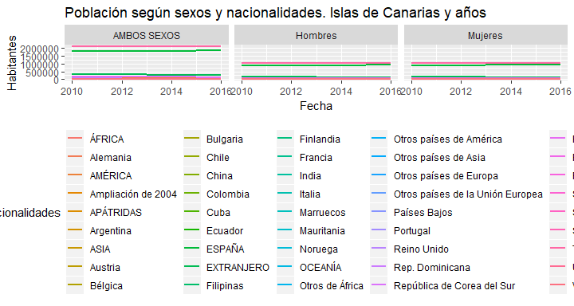

<!-- README.md is generated from README.Rmd. Please edit that file -->

[](https://GitHub.com/rOpenSpain/istacbaser/stargazers/)
[](https://github.com/rOpenSpain/istacbaser/graphs/commit-activity)
[](https://GitHub.com/rOpenSpain/istacbaser/graphs/contributors/)
[](https://github.com/rOpenSpain/istacbaser)
[](https://github.com/rOpenSpain/istacbaser)

# Introduction

The [Canary Islands Statistics Institute (Instituto Canario de
Estadítica, ISTAC)](http://www.gobiernodecanarias.org/istac/) is the
central organ of the autonomous statistical system and official research
center of the Government of the Canary Islands, created and regulated by
Law 1/1991 of 28 January, Statistics of the Autonomous Community of the
Canary Islands (CAC), and among others, assigns the following functions:

  - Providing statistical information: The ISTAC has among its
    objectives to provide, with technical and professional independence,
    statistical information of interest to the CAC, taking into account
    the fragmentation of the territory and its singularities and
    complying with the principles established in the Code of Good
    Practices of the European Statistics.

  - Coordinate public statistical activity: The ISTAC is the body
    responsible for promoting, managing and coordinating the public
    statistical activity of the CAC, assuming the exercise of the
    statutory competence provided for in Article 30, paragraph 23, of
    the Statute of Autonomy of the Canary Islands .

To help provide access to this rich source of information, ISTAC
themselves, provide a well structured
[API](https://es.slideshare.net/ISTAC/guia-de-uso-api-de-acceso-a-istac-base).
While this API is very useful for integration into web services and
other high-level applications, it becomes quickly overwhelming for
researchers who have neither the time nor the expertise to develop
software to interface with the API. This leaves the researcher to rely
on manual bulk downloads of spreadsheets of the data they are interested
in. This too is can quickly become overwhelming, as the work is manual,
time consuming, and not easily reproducible.

## istacbaser

The goal of the `istacbaser` R-package is to provide a bridge between
these alternatives and allow researchers to focus on their research
questions and not the question of accessing the data. The `istacbaser`
R-package allows researchers to quickly search and download the data of
their particular interest in a programmatic and reproducible fashion;
this facilitates a seamless integration into their workflow and allows
analysis to be quickly rerun on different areas of interest and with
realtime access to the latest available data.

## Installation

You can install the released version of istacbaser from
[Github](https://github.com/rOpenSpain/istacbaser) with:

``` r
devtools::install.github("rOpenSpain/istacbaser")
```

### Highlighted features of the `istacbaser` R-package:

  - Access to all data available in the API
  - Support for searching and downloading data
  - Ability to return `POSIXct` dates for easy integration into plotting
    and time-series analysis techniques
  - Support for Most Recent Value queries
  - Support for `grep` style searching for data descriptions and names

# Getting Started

The first step would be searching for the data you are interested in.
`istacbase_search()` provides `grep` style searching of all available
indicators from the ISTAC API and returns the indicator information that
matches your query.

## Finding available data with `cache`

For performance and ease of use, a cached version of useful information
is provided with the `istacbaser` R-package. This data is called `cache`
and provides a snapshot of available islands, indicators, and other
relevant information. `cache` is by default the the source from which
`istacbase_search()` and `istacbase()` uses to find matching
information. The structure of `cache` is as follows

``` r
library(istacbaser)

str(cache, max.level = 1)
#> 'data.frame':    5404 obs. of  11 variables:
#>  $ tema              : chr  "Territorio y medio ambiente" "Territorio y medio ambiente" "Territorio y medio ambiente" "Territorio y medio ambiente" ...
#>  $ subtemaI          : chr  "Territorio y usos del suelo" "Territorio y usos del suelo" "Territorio y usos del suelo" "Territorio y usos del suelo" ...
#>  $ subtemaII         : chr  "Estadística del Territorio" "Estadística del Territorio" "Estadística del Territorio" "Estadística del Territorio" ...
#>  $ datos publicadosI : chr  "Resultados principales. Canarias" "Resultados principales. Canarias" "Resultados principales. Canarias" "Resultados principales. Canarias" ...
#>  $ datos publicadosII: chr  NA NA NA NA ...
#>  $ apijson           : chr  "http://www.gobiernodecanarias.org/istac/jaxi-istac/tabla.do?accion=jsonMtd&uuidConsulta=b73d4c68-3f80-4b24-b890-8a555c850c84" "http://www.gobiernodecanarias.org/istac/jaxi-istac/tabla.do?accion=jsonMtd&uuidConsulta=25911ebf-c5b2-41a6-a9e9-7d21b1e01760" "http://www.gobiernodecanarias.org/istac/jaxi-istac/tabla.do?accion=jsonMtd&uuidConsulta=017492bd-f646-45e1-ba8a-4afbfbae0c1a" "http://www.gobiernodecanarias.org/istac/jaxi-istac/tabla.do?accion=jsonMtd&uuidConsulta=ac45f470-2546-4e56-ba15-ec2a42235928" ...
#>  $ lista_tablas      : chr  NA NA NA NA ...
#>  $ titulo            : chr  "Superficie por islas de Canarias." "Superficie por principales islotes de Canarias." "Número y superficie de los roques por islas de Canarias." "Superficie según zonas altimétricas por provincias de Canarias." ...
#>  $ origen            : chr  "Instituto Canario de Estadística (ISTAC), Instituto Nacional de Estadística (INE) y Dirección General del Insti"| __truncated__ "Instituto Canario de Estadística (ISTAC), Instituto Nacional de Estadística (INE) y Dirección General del Insti"| __truncated__ "Instituto Canario de Estadística (ISTAC) a partir de datos del Instituto Geográfico Nacional." "Instituto Canario de Estadística (ISTAC), Instituto Nacional de Estadística (INE) y Dirección General del Insti"| __truncated__ ...
#>  $ encuesta          : chr  "Estadística del Territorio" "Estadística del Territorio" "Estadística del Territorio" "Estadística del Territorio" ...
#>  $ ID                : chr  "ter.ter.est.res.1" "ter.ter.est.res.2" "ter.ter.est.res.3" "ter.ter.est.res.4" ...
```

## Search available data with `istacbase_search()`

`istacbase_search()` searches through the `cache` data frame to find
indicators that match a search pattern. An example of the structure of
this data frame is below

|      | tema     | subtemaI | subtemaII                           | datos publicadosI | datos publicadosII   | apijson                                                                                                                        | lista\_tablas | titulo                                                                                             | origen                                                                         | encuesta                      | ID                   |
| ---- | :------- | :------- | :---------------------------------- | :---------------- | :------------------- | :----------------------------------------------------------------------------------------------------------------------------- | :------------ | :------------------------------------------------------------------------------------------------- | :----------------------------------------------------------------------------- | :---------------------------- | :------------------- |
| 9801 | Sociedad | Salud    | Encuesta de Salud de Canarias (ESC) | ESC 2009          | III. Hábitos de vida | <http://www.gobiernodecanarias.org/istac/jaxi-istac/tabla.do?accion=jsonMtd&uuidConsulta=b1834d59-afb7-459e-b3b2-990fdaea7ae0> | NA            | Población de 16 y más años según clasificación de consumo de tabaco por comarcas. 2009.            | Instituto Canario de Estadística (ISTAC) y Servicio Canario de la Salud (SCS). | Encuesta de Salud de Canarias | soc.sal.enc.esc.4310 |
| 9811 | Sociedad | Salud    | Encuesta de Salud de Canarias (ESC) | ESC 2009          | III. Hábitos de vida | <http://www.gobiernodecanarias.org/istac/jaxi-istac/tabla.do?accion=jsonMtd&uuidConsulta=cbd73c95-1984-444f-88bb-98045f477680> | NA            | Población de 16 y más años fumadora según frecuencia de consumo de tabaco y sexos. Canarias. 2009. | Instituto Canario de Estadística (ISTAC) y Servicio Canario de la Salud (SCS). | Encuesta de Salud de Canarias | soc.sal.enc.esc.4311 |

By default the search is done over the `titulo` field and returns all
the columns of the matching rows. The `ID` values are inputs into
`istac()`, the function for downloading the data. To return the key
columns `ID` and `titulo` for the `cache` data frame, you can set `extra
= TRUE`.

``` r
library(istacbaser)

busqueda <- istacbase_search(pattern = "parado")
head(busqueda)
#>           tema        subtemaI
#> 308 Demografía       Población
#> 482   Sociedad Calidad de Vida
#> 485   Sociedad Calidad de Vida
#> 534   Sociedad Calidad de Vida
#> 748   Sociedad Calidad de Vida
#> 793   Sociedad Calidad de Vida
#>                                                                        subtemaII
#> 308                                              Censos de Población y Viviendas
#> 482 Encuesta de ingresos y condiciones de vida de los hogares canarios (EICV-HC)
#> 485 Encuesta de ingresos y condiciones de vida de los hogares canarios (EICV-HC)
#> 534 Encuesta de ingresos y condiciones de vida de los hogares canarios (EICV-HC)
#> 748 Encuesta de ingresos y condiciones de vida de los hogares canarios (EICV-HC)
#> 793 Encuesta de ingresos y condiciones de vida de los hogares canarios (EICV-HC)
#>                                                      datos publicadosI
#> 308 Resultados detallados. Municipios por islas de Canarias. 1-11-2011
#> 482                                                       EICV-HC 2013
#> 485                                                       EICV-HC 2013
#> 534                                                       EICV-HC 2013
#> 748                                                       EICV-HC 2007
#> 793                                                       EICV-HC 2007
#>                           datos publicadosII
#> 308                                     <NA>
#> 482                                  Empleo.
#> 485                                  Empleo.
#> 534 Pobreza, ingresos y situación económica.
#> 748                                  Empleo.
#> 793 Pobreza, ingresos y situación económica.
#>                                                                                                                          apijson
#> 308 http://www.gobiernodecanarias.org/istac/jaxi-istac/tabla.do?accion=jsonMtd&uuidConsulta=98417e88-69e1-49cf-bcad-2deb6463a24c
#> 482 http://www.gobiernodecanarias.org/istac/jaxi-istac/tabla.do?accion=jsonMtd&uuidConsulta=b76018b8-eae9-4bc4-a580-c729ff3c7771
#> 485 http://www.gobiernodecanarias.org/istac/jaxi-istac/tabla.do?accion=jsonMtd&uuidConsulta=70e642c0-60b6-429e-9b69-0c68bccdbd0a
#> 534 http://www.gobiernodecanarias.org/istac/jaxi-istac/tabla.do?accion=jsonMtd&uuidConsulta=570794e8-8792-4364-aea3-6f514db51c3f
#> 748 http://www.gobiernodecanarias.org/istac/jaxi-istac/tabla.do?accion=jsonMtd&uuidConsulta=db68fa6c-9252-4fbe-b0af-161d90edf2f5
#> 793 http://www.gobiernodecanarias.org/istac/jaxi-istac/tabla.do?accion=jsonMtd&uuidConsulta=3d3088e0-96e1-4736-b516-1696db062366
#>     lista_tablas
#> 308         <NA>
#> 482         <NA>
#> 485         <NA>
#> 534         <NA>
#> 748         <NA>
#> 793         <NA>
#>                                                                                                                                  titulo
#> 308 Viviendas familiares principales u hogares según el número de parados de 16 a 64 años. Municipios por islas de Canarias. 1-11-2011.
#> 482                                                                                    Hogares según número de parados por islas. 2013.
#> 485                                                                 Hogares según número de parados y tamaño del hogar por islas. 2013.
#> 534                                                    Hogares según umbral de pobreza y número de parados en el hogar. Canarias. 2013.
#> 748                                                                                 Hogares según número de parados por comarcas. 2007.
#> 793                                                                Hogares según umbral de pobreza y número de parados. Canarias. 2007.
#>                                                                                                      origen
#> 308 Instituto Canario de Estadística (ISTAC) a partir de datos del Instituto Nacional de Estadística (INE).
#> 482                                                               Instituto Canario de Estadística (ISTAC).
#> 485                                                               Instituto Canario de Estadística (ISTAC).
#> 534                                                               Instituto Canario de Estadística (ISTAC).
#> 748                                                               Instituto Canario de Estadística (ISTAC).
#> 793                                                               Instituto Canario de Estadística (ISTAC).
#>                                                               encuesta
#> 308                                    Censos de Población y Viviendas
#> 482 Encuesta de ingresos y condiciones de vida de los hogares canarios
#> 485 Encuesta de ingresos y condiciones de vida de los hogares canarios
#> 534 Encuesta de ingresos y condiciones de vida de los hogares canarios
#> 748 Encuesta de ingresos y condiciones de vida de los hogares canarios
#> 793 Encuesta de ingresos y condiciones de vida de los hogares canarios
#>                      ID
#> 308 dem.pob.cen.res.430
#> 482 soc.cal.enc.eic.603
#> 485 soc.cal.enc.eic.606
#> 534 soc.cal.enc.eic.655
#> 748 soc.cal.enc.eic.869
#> 793 soc.cal.enc.eic.914
```

Other fields can be searched by simply changing the `fields` parameter.
For example

``` r
library(istacbaser)

EPA_busqueda <- istacbase_search(pattern = "Encuesta de Población Activa", fields = "encuesta")
head(EPA_busqueda)
#>         tema                           subtemaI subtemaII
#> 14121 Empleo Encuesta de Población Activa (EPA)      <NA>
#> 14131 Empleo Encuesta de Población Activa (EPA)      <NA>
#> 14141 Empleo Encuesta de Población Activa (EPA)      <NA>
#> 14151 Empleo Encuesta de Población Activa (EPA)      <NA>
#> 14161 Empleo Encuesta de Población Activa (EPA)      <NA>
#> 14171 Empleo Encuesta de Población Activa (EPA)      <NA>
#>       datos publicadosI datos publicadosII
#> 14121  Avance datos EPA               <NA>
#> 14131  Avance datos EPA               <NA>
#> 14141  Avance datos EPA               <NA>
#> 14151  Avance datos EPA               <NA>
#> 14161  Avance datos EPA               <NA>
#> 14171  Avance datos EPA               <NA>
#>                                                                                                                            apijson
#> 14121 http://www.gobiernodecanarias.org/istac/jaxi-istac/tabla.do?accion=jsonMtd&uuidConsulta=3df3cf8b-9c8d-4cb6-bd17-19c0aa5fd26b
#> 14131 http://www.gobiernodecanarias.org/istac/jaxi-istac/tabla.do?accion=jsonMtd&uuidConsulta=cae96d81-ca6f-4906-9a79-679e8460f9d0
#> 14141 http://www.gobiernodecanarias.org/istac/jaxi-istac/tabla.do?accion=jsonMtd&uuidConsulta=d28e8036-16c8-44f7-91a8-1cc46738e0c8
#> 14151 http://www.gobiernodecanarias.org/istac/jaxi-istac/tabla.do?accion=jsonMtd&uuidConsulta=160d5ebb-6153-4bd1-b58a-4177033de928
#> 14161 http://www.gobiernodecanarias.org/istac/jaxi-istac/tabla.do?accion=jsonMtd&uuidConsulta=921f39e6-5b53-44f6-ac2c-bec77a75cebb
#> 14171 http://www.gobiernodecanarias.org/istac/jaxi-istac/tabla.do?accion=jsonMtd&uuidConsulta=5e14c5e4-66e4-48df-ba7e-75ace4f27531
#>                     lista_tablas
#> 14121 Avance datos EPA. Canarias
#> 14131 Avance datos EPA. Canarias
#> 14141 Avance datos EPA. Canarias
#> 14151 Avance datos EPA. Canarias
#> 14161 Avance datos EPA. Canarias
#> 14171 Avance datos EPA. Canarias
#>                                                                                                                                 titulo
#> 14121           Población de 16 y más años según relaciones con la actividad económica e indicadores. Canarias. 2017 Tercer trimestre.
#> 14131 Población de 16 y más años según relaciones con la actividad económica, grupos de edad y sexos. Canarias. 2017 Tercer trimestre.
#> 14141 Población de 16 y más años según relaciones con la actividad económica, nacionalidades y sexos. Canarias. 2017 Tercer trimestre.
#> 14151                                                     Población activa según sectores económicos. Canarias. 2017 Tercer trimestre.
#> 14161                                              Población ocupada según tipos de jornadas y sexos. Canarias. 2017 Tercer trimestre.
#> 14171                                          Población asalariada según tipos de contratos y sexos. Canarias. 2017 Tercer trimestre.
#>                                                                                                        origen
#> 14121 Instituto Canario de Estadística (ISTAC) a partir de datos del Instituto Nacional de Estadística (INE).
#> 14131 Instituto Canario de Estadística (ISTAC) a partir de datos del Instituto Nacional de Estadística (INE).
#> 14141 Instituto Canario de Estadística (ISTAC) a partir de datos del Instituto Nacional de Estadística (INE).
#> 14151 Instituto Canario de Estadística (ISTAC) a partir de datos del Instituto Nacional de Estadística (INE).
#> 14161 Instituto Canario de Estadística (ISTAC) a partir de datos del Instituto Nacional de Estadística (INE).
#> 14171 Instituto Canario de Estadística (ISTAC) a partir de datos del Instituto Nacional de Estadística (INE).
#>                           encuesta                  ID
#> 14121 Encuesta de Población Activa emp.enc.na.ava.4742
#> 14131 Encuesta de Población Activa emp.enc.na.ava.4743
#> 14141 Encuesta de Población Activa emp.enc.na.ava.4744
#> 14151 Encuesta de Población Activa emp.enc.na.ava.4745
#> 14161 Encuesta de Población Activa emp.enc.na.ava.4746
#> 14171 Encuesta de Población Activa emp.enc.na.ava.4747
```

Regular expressions are also supported.

``` r
library(istacbaser)

# 'pobreza' OR 'parados' OR 'trabajador'
popatr_busqueda <- istacbase_search(pattern = "pobreza|parados|trabajador")

head(popatr_busqueda)
#>           tema        subtemaI
#> 308 Demografía       Población
#> 482   Sociedad Calidad de Vida
#> 485   Sociedad Calidad de Vida
#> 523   Sociedad Calidad de Vida
#> 524   Sociedad Calidad de Vida
#> 525   Sociedad Calidad de Vida
#>                                                                        subtemaII
#> 308                                              Censos de Población y Viviendas
#> 482 Encuesta de ingresos y condiciones de vida de los hogares canarios (EICV-HC)
#> 485 Encuesta de ingresos y condiciones de vida de los hogares canarios (EICV-HC)
#> 523 Encuesta de ingresos y condiciones de vida de los hogares canarios (EICV-HC)
#> 524 Encuesta de ingresos y condiciones de vida de los hogares canarios (EICV-HC)
#> 525 Encuesta de ingresos y condiciones de vida de los hogares canarios (EICV-HC)
#>                                                      datos publicadosI
#> 308 Resultados detallados. Municipios por islas de Canarias. 1-11-2011
#> 482                                                       EICV-HC 2013
#> 485                                                       EICV-HC 2013
#> 523                                                       EICV-HC 2013
#> 524                                                       EICV-HC 2013
#> 525                                                       EICV-HC 2013
#>                           datos publicadosII
#> 308                                     <NA>
#> 482                                  Empleo.
#> 485                                  Empleo.
#> 523 Pobreza, ingresos y situación económica.
#> 524 Pobreza, ingresos y situación económica.
#> 525 Pobreza, ingresos y situación económica.
#>                                                                                                                          apijson
#> 308 http://www.gobiernodecanarias.org/istac/jaxi-istac/tabla.do?accion=jsonMtd&uuidConsulta=98417e88-69e1-49cf-bcad-2deb6463a24c
#> 482 http://www.gobiernodecanarias.org/istac/jaxi-istac/tabla.do?accion=jsonMtd&uuidConsulta=b76018b8-eae9-4bc4-a580-c729ff3c7771
#> 485 http://www.gobiernodecanarias.org/istac/jaxi-istac/tabla.do?accion=jsonMtd&uuidConsulta=70e642c0-60b6-429e-9b69-0c68bccdbd0a
#> 523 http://www.gobiernodecanarias.org/istac/jaxi-istac/tabla.do?accion=jsonMtd&uuidConsulta=823163c5-5b59-4b64-9113-21f5e576723a
#> 524 http://www.gobiernodecanarias.org/istac/jaxi-istac/tabla.do?accion=jsonMtd&uuidConsulta=a3a28ae3-9955-49e4-abf8-b9aa4a3fc302
#> 525 http://www.gobiernodecanarias.org/istac/jaxi-istac/tabla.do?accion=jsonMtd&uuidConsulta=ddeb06e1-5b24-4ff7-b6bf-61dd7bea2870
#>     lista_tablas
#> 308         <NA>
#> 482         <NA>
#> 485         <NA>
#> 523         <NA>
#> 524         <NA>
#> 525         <NA>
#>                                                                                                                                  titulo
#> 308 Viviendas familiares principales u hogares según el número de parados de 16 a 64 años. Municipios por islas de Canarias. 1-11-2011.
#> 482                                                                                    Hogares según número de parados por islas. 2013.
#> 485                                                                 Hogares según número de parados y tamaño del hogar por islas. 2013.
#> 523              Valor límite del ingreso mensual disponible del hogar que lo sitúa bajo el umbral de pobreza relativa. Canarias. 2013.
#> 524                                                                                       Otros indicadores de pobreza. Canarias. 2013.
#> 525                                                                  Hogares según umbral de pobreza moderada y severa por islas. 2013.
#>                                                                                                      origen
#> 308 Instituto Canario de Estadística (ISTAC) a partir de datos del Instituto Nacional de Estadística (INE).
#> 482                                                               Instituto Canario de Estadística (ISTAC).
#> 485                                                               Instituto Canario de Estadística (ISTAC).
#> 523                                                               Instituto Canario de Estadística (ISTAC).
#> 524                                                               Instituto Canario de Estadística (ISTAC).
#> 525                                                               Instituto Canario de Estadística (ISTAC).
#>                                                               encuesta
#> 308                                    Censos de Población y Viviendas
#> 482 Encuesta de ingresos y condiciones de vida de los hogares canarios
#> 485 Encuesta de ingresos y condiciones de vida de los hogares canarios
#> 523 Encuesta de ingresos y condiciones de vida de los hogares canarios
#> 524 Encuesta de ingresos y condiciones de vida de los hogares canarios
#> 525 Encuesta de ingresos y condiciones de vida de los hogares canarios
#>                      ID
#> 308 dem.pob.cen.res.430
#> 482 soc.cal.enc.eic.603
#> 485 soc.cal.enc.eic.606
#> 523 soc.cal.enc.eic.644
#> 524 soc.cal.enc.eic.645
#> 525 soc.cal.enc.eic.646
```

## Downloading data with `istacbase()`

Once you have found the set of indicators that you would like to explore
further, the next step is downloading the data with `istacbase()`. The
following examples are meant to highlight the different ways in which
`istacbase()` can be used and demonstrate the major optional parameters.

The default value for the `islas` parameter is a special value of `all`
which as you might expect, returns data on the selected `ID` for every
available country or region, if it is aviable.

``` r
library(istacbaser)

pop_data <- istacbase(istacbase_table = "dem.pob.exp.res.40")

head(pop_data)
#>      Islas Nacionalidades       Sexos Años   valor
#> 1 CANARIAS          TOTAL AMBOS SEXOS 2018 2127685
#> 2 CANARIAS          TOTAL     Hombres 2018 1054032
#> 3 CANARIAS          TOTAL     Mujeres 2018 1073653
#> 4 CANARIAS          TOTAL AMBOS SEXOS 2017 2108121
#> 5 CANARIAS          TOTAL     Hombres 2017 1045113
#> 6 CANARIAS          TOTAL     Mujeres 2017 1063008
```

If you are interested in only some subset of islands you can pass along
the specific island to the `island` parameter. The islands that can be
passed to the `islas` parameter correspond to
`all`,`Canarias`,`Lanzarote`,`Fuerteventura`,`Gran
Canaria`,`Tenerife`,`La Gomera`,`La Palma` or `El Hierro`.

``` r
library(istacbaser)

# Population, total
# country values: iso3c, iso2c, regionID, adminID, incomeID
pop_data <- istacbase(islas = c("Lanzarote","Fuerteventura"), istacbase_table = "dem.pob.exp.res.40")

head(pop_data)
#>          Islas Nacionalidades       Sexos Años  valor
#> 2566 Lanzarote          TOTAL AMBOS SEXOS 2018 149183
#> 2567 Lanzarote          TOTAL     Hombres 2018  75487
#> 2568 Lanzarote          TOTAL     Mujeres 2018  73696
#> 2569 Lanzarote          TOTAL AMBOS SEXOS 2017 147023
#> 2570 Lanzarote          TOTAL     Hombres 2017  74487
#> 2571 Lanzarote          TOTAL     Mujeres 2017  72536
```

### Using `POSIXct`

Setting the parameter `POSIXct = TRUE` gives you the posibility to work
with dates. You can set a `startdate` and `enddate`.

``` r
library(istacbaser)

# islas values: all,Canarias,Lanzarote,Fuerteventura,Gran Canaria,Tenerife,La Gomera,La Palma or El Hierro
pop_data <- istacbase(islas = c("Lanzarote","Fuerteventura"), istacbase_table = "dem.pob.exp.res.40")

head(pop_data)
#>          Islas Nacionalidades       Sexos Años  valor
#> 2566 Lanzarote          TOTAL AMBOS SEXOS 2018 149183
#> 2567 Lanzarote          TOTAL     Hombres 2018  75487
#> 2568 Lanzarote          TOTAL     Mujeres 2018  73696
#> 2569 Lanzarote          TOTAL AMBOS SEXOS 2017 147023
#> 2570 Lanzarote          TOTAL     Hombres 2017  74487
#> 2571 Lanzarote          TOTAL     Mujeres 2017  72536
```

### Using `POSIXct = TRUE`

The default format for the `Periodo` or `Años` column is not conducive
to sorting or plotting, especially when downloading sub annual data,
such as monthly or quarterly data. To address this, if `TRUE`, the
`POSIXct` parameter adds the additional columns `fecha` and
`periodicidad`. `fecha` converts the default date into a `POSIXct`.
`periodicidad` denotes the time resolution that the date represents.
This option requires the use of the package `lubridate (>= 1.5.0)`. If
`POSIXct = TRUE` and `lubridate (>= 1.5.0)` is not available, a
`warning` is produced and the option is ignored.

`startdate` and `enddate` must be in the format `YYYY`.

``` r
library(istacbaser)

pop_data <- istacbase(istacbase_table = "dem.pob.exp.res.40", POSIXct = TRUE, startdate = 2010, enddate = 2016)

head(pop_data)
#>       Islas Nacionalidades       Sexos Años   valor      fecha
#> 7  CANARIAS          TOTAL AMBOS SEXOS 2016 2101924 2016-01-01
#> 8  CANARIAS          TOTAL     Hombres 2016 1042838 2016-01-01
#> 9  CANARIAS          TOTAL     Mujeres 2016 1059086 2016-01-01
#> 10 CANARIAS          TOTAL AMBOS SEXOS 2015 2100306 2015-01-01
#> 11 CANARIAS          TOTAL     Hombres 2015 1043203 2015-01-01
#> 12 CANARIAS          TOTAL     Mujeres 2015 1057103 2015-01-01
#>    periodicidad
#> 7         anual
#> 8         anual
#> 9         anual
#> 10        anual
#> 11        anual
#> 12        anual
```

The `POSIXct = TRUE` option makes plotting and sorting dates much
easier.

``` r
library(istacbaser)
library(ggplot2)
#> Warning: package 'ggplot2' was built under R version 3.5.1

pop_data <- istacbase(islas = "Canarias", istacbase_table = "dem.pob.exp.res.40", POSIXct = TRUE, startdate = 2010, enddate = 2016)


ggplot(pop_data, aes(x = fecha, y = valor, colour = Nacionalidades)) +
  geom_line(size = 1) +
  labs(title = "Población según sexos y nacionalidades. Islas de Canarias y años", x = "Fecha", y = "Habitantes") +
  theme(legend.key=element_blank(), legend.key.size=unit(1,"point"),
        legend.text=element_text(size=7), axis.text.x = element_text(angle = 45, hjust = 1)) +
  guides(colour=guide_legend(nrow=20)) +
  facet_wrap(~ Sexos)
```



### Using `mrv`

If you do not know the latest date an indicator you are interested in is
available you can use the `mrv` instead of `startdate` and `enddate`.
`mrv` stands for most recent value and takes a `integer` corresponding
to the number of most recent values you wish to return

``` r
library(istacbaser)

pop_data <- istacbase(istacbase_table = 'dem.pob.exp.res.40', POSIXct = TRUE, mrv = 1)

head(pop_data)
#>       Islas Nacionalidades       Sexos Años   valor      fecha
#> 1  CANARIAS          TOTAL AMBOS SEXOS 2018 2127685 2018-01-01
#> 2  CANARIAS          TOTAL     Hombres 2018 1054032 2018-01-01
#> 3  CANARIAS          TOTAL     Mujeres 2018 1073653 2018-01-01
#> 58 CANARIAS         ESPAÑA AMBOS SEXOS 2018 1867494 2018-01-01
#> 59 CANARIAS         ESPAÑA     Hombres 2018  924342 2018-01-01
#> 60 CANARIAS         ESPAÑA     Mujeres 2018  943152 2018-01-01
#>    periodicidad
#> 1         anual
#> 2         anual
#> 3         anual
#> 58        anual
#> 59        anual
#> 60        anual
```

You can increase this value and it will return no more than the `mrv`
value. However, if `mrv` is greater than the number of available data it
will return all data instead.

### Using `freq`

If the data has several granularity, you can select son eof them with
the parameter `freq`. Possible values are:
`anual`,`semestral`,`trimestral`,`mensual`,`quincenal`,`semanal`. If the
granularity selected is not aviable all granularity will be showed.

``` r
library(istacbaser)

soc_data <- istacbase(istacbase_table = 'soc.sal.est.ser.1625', POSIXct = TRUE, freq = "semestral")
#> Warning in istacbase_get(istacbase_table): NAs introducidos por coerción

head(soc_data)
#>   Servicios quirúrgicos     Islas Tiempo de espera Periodos valor
#> 1                 TOTAL  CANARIAS            TOTAL  2017M06 32419
#> 2                 TOTAL  CANARIAS Menos de 6 meses  2017M06 21926
#> 3                 TOTAL  CANARIAS   Más de 6 meses  2017M06 10493
#> 4                 TOTAL Lanzarote            TOTAL  2017M06  1751
#> 5                 TOTAL Lanzarote Menos de 6 meses  2017M06  1196
#> 6                 TOTAL Lanzarote   Más de 6 meses  2017M06   555
#>        fecha periodicidad
#> 1 2017-06-01    semestral
#> 2 2017-06-01    semestral
#> 3 2017-06-01    semestral
#> 4 2017-06-01    semestral
#> 5 2017-06-01    semestral
#> 6 2017-06-01    semestral
```

## `startdate`, `enddate`, `mrv`, `freq` with `POSIXct = FALSE`

If you make a query with `istac()` and `POSIXct = FALSE` the
`startdate`, `enddate`, `mrv`, `freq` are ignored and the function will
launch a warning.

``` r
library(istacbaser)

soc_data <- istacbase(istacbase_table = 'soc.sal.est.ser.1625', POSIXct = FALSE, freq = "semestral")
#> Warning in istacbase_get(istacbase_table): NAs introducidos por coerción
#> Warning in istacbase(istacbase_table = "soc.sal.est.ser.1625", POSIXct =
#> FALSE, : startdate, enddate, mrv, freq are ignored when POSCIXct is set to
#> FALSE.

head(soc_data)
#>   Servicios quirúrgicos     Islas Tiempo de espera Periodos valor
#> 1                 TOTAL  CANARIAS            TOTAL  2017M06 32419
#> 2                 TOTAL  CANARIAS Menos de 6 meses  2017M06 21926
#> 3                 TOTAL  CANARIAS   Más de 6 meses  2017M06 10493
#> 4                 TOTAL Lanzarote            TOTAL  2017M06  1751
#> 5                 TOTAL Lanzarote Menos de 6 meses  2017M06  1196
#> 6                 TOTAL Lanzarote   Más de 6 meses  2017M06   555
```

[](https://github.com/rOpenSpain/istacbaser)
by [Christian González-Martel](https://github.com/chrglez) & [José
Manuel Cazorla Artiles](https://github.com/jmcartiles)
